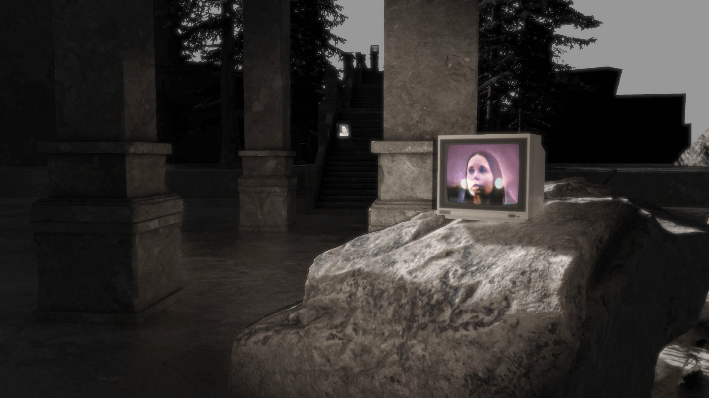

# Drone Filler



**Drone Filler** is a compo filler released at **EVOKE 2025** (Köln, Germany).  
It started as a rough visual mock-up for a bigger project, then turned into a quick demo just two weeks before the EVOKE's demoparty deadline.  
Blending kitbashed 3D assets, hand-animated cameras and an atmospheric drone soundtrack, it explored quick experimentation, visual hypotheses and the joy of bringing outsiders into the demoscene.

---

## 🕹️ How to Run

### Windows

```bat
start-demo.bat
```

## 📎 Links

- :trumpet: [Pouët release page](https://www.pouet.net/prod.php?which=104752)
- 📽️ [Video capture](https://www.youtube.com/watch?v=ZShYipir2Eg)
- 💾 [Download & binaries](https://github.com/astrofra/demo-drone-filler/releases)  

---

## 👤 Credits

- Fra (Concept & Code)  
- [Nicolas Tilly](https://nicolastilly.fr/) (Music)  
- [XBarr](https://github.com/ejulien/) (Engine)  
- [Mooz](https://github.com/BlockoS) (Engine contributions)  
- [MadMarie](https://www.flickr.com/photos/38623641@N05/) (Photography)  
- [KitBash3D](https://kitbash3d.com/) (3D Models)
